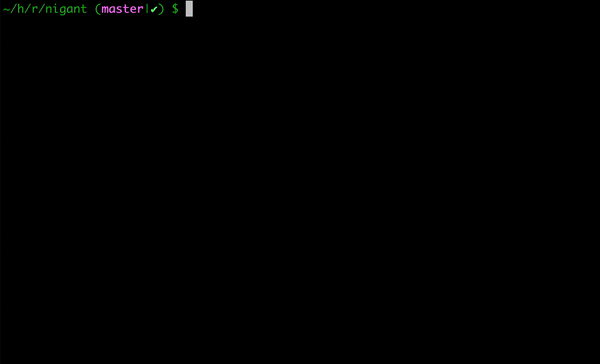

# Nigant
A Thesaurus for the Terminal



## Etymology
`Nigant` comes the Sanskrit word `निघण्टु` (Nighaṇṭu), meaning a glossary or a partial lexicon.

## Usage
Since the current version of the application is a beta release, we do **not** distribute it via the usual channels. You will have to build it before use. Refer section on [Building](#Building) for build instructions.

```
$ ./target/release/nigant <word> 
```

```
$ ./target/release/nigant pastiche                                                                                                 
pastiche
Definitions:
	 - an artistic work in a style that imitates that of another work, artist, or period
	 - imitate the style of (an artist or work)

Synonyms:
imitation, parody, take-off, parody, take off, burlesque, pastiche, make fun of

Etymology:
	 - late 19th century: from French, from Italian pasticcio, based on late Latin pasta‘paste’
```

`Nigant` relies on the [Oxford Developer API](https://developer.oxforddictionaries.com/). Generate your `APP_ID` & `APP_KEY`, and place it in an `.env` file at the root of the `Nigant` directory.

## Building
`Nigant` is written in Rust, so you'll need to grab a Rust installation in order to compile it. In general, `Nigant` tracks the latest stable release of the Rust compiler.

To build `Nigant`:
```
$ git clone https://github.com/twinair/nigant
$ cd nigant
$ cargo build --release
$ ./target/release/nigant --version
nigant 0.1.0
```
